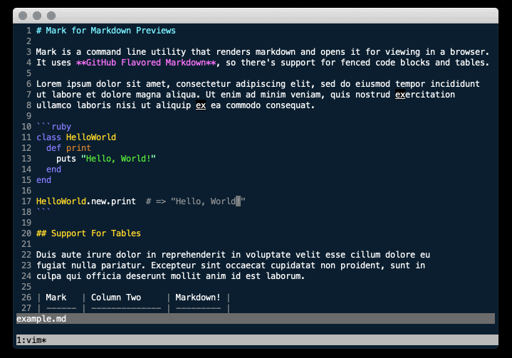

# Mark

Command line utility to preview markdown in a browser.



## Installation

Download the binary here:

* [mark v0.1.1](https://github.com/hughbien/mark/releases/tag/v0.1.1)

Or checkout this repo and build it with `make build`. The binary should be located at `bin/mark`.

## Usage

Render a markdown file in your browser:

```
mark <file.md>
```

By default, this renders markdown into the target file `.mark.html` of the current directory.  This
target file is deleted after being opened in the browser. You can specify a different target
location via the `-t`/`--target` option. Or set the `MARK_TARGET` env var:

```
mark --target /path/to/target.html <file.md>
```

Note that this may break relative assets like images. To prevent deletion after opening, use the
`-k`/`--keep` option. Or set the `MARK_KEEP` env var.

```
mark --keep <file.md>
```

Without `--keep`, the target file is kept for 300ms by default. To extend this time use the
`-K`/`--keep-for` option or set the `MARK_KEEP_FOR` env var.

```
mark --keep-for 500 <file.md>
```

You can create your own template too. Just create an HTML template, the string `#{BODY}` will be
substituted with the rendered markdown. The default location for the template is
`~/.mark/template.html`. Or you can specify it with `-T`/`--template`.

```
mark --template /path/to/template.html <file.md>
```

Mark uses `open` to open the rendered file by default. To override this, either use the `MARK_OPEN`
env var or `-o`/`--open` option. Pass a string with the `%` placeholder, which will be the filename.

```
mark --open "firefox %" <file.md>
```

## Development

Use `make` for common tasks:

```
make spec                         # to run all tests
make spec ARGS=path/to/spec       # to run a single test
make build                        # to create a release binary in the bin directory
make install                      # to copy release binary into system bin (uses $INSTALL_BIN)
make release                      # to build releases for darwin/linux (requires docker)
make clean                        # to remove build artifacts and bin directory
make run ARGS="file1.md file2.md" # to run locally
make run ARGS=-h                  # to run with local arguments
```

## TODO

* fix alpine-linux release build
